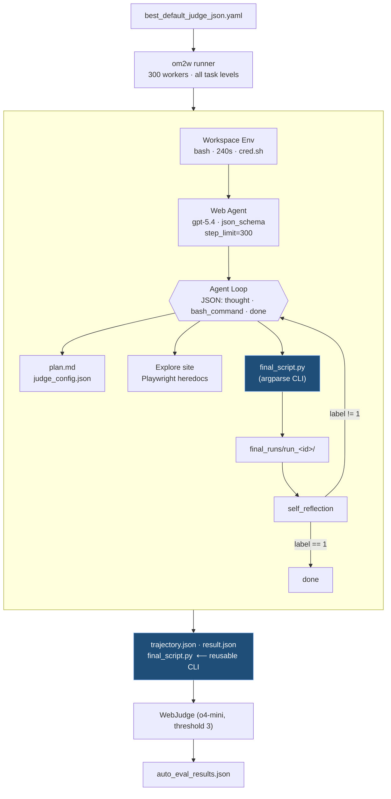

<!-- # Web2Skill: Web Agents That Write code, Not Clicks -->
<!-- # Web2Skill: Rewrite the Internet, for Agent -->
<!-- # Web2Skill: Solving Web Tasks By Writing Reusable Code In A Terminal -->
<!-- # Web2Skill: A Simple Terminal Is the Best Harness for Web Agent -->
# Web2Skill: A Simple Terminal Is All you Need for Web Agent


*Instead of solving web tasks by predicting where to click one at a time, we only give LLM a terminal where it has the full freedom to spwan browser sessions, and to explore websites through writing code. The final result is a readable and reusable program — and the program became a reusable CLI/RPA script. We found this minimal harness to be surprisingly effective.*

---

## TL;DR

1. The usual web agent predicts `click(412, 318)` and `type("Bentonville")` one primitive at a time. We use a different vocabulary. We designed a minimalist harness where the agent only has a terminal with a local workspace. It emits a single **bash command**, and drives the browser through real Playwright code — **86.67% on Online-Mind2Web** at a 100-step budget.
2. Because every action is code, the trajectory's final artifact is a runnable python script — not a list of clicks. The same script that solves "find a 5-mile-radius BBB used-car dealer in New York, NY" becomes, with a two-line `argparse` block, a **reusable CLI** that takes `--query`, `--location`, `--max_distance_miles`, and `--rating_rank`.
3. This is RPA script the agent wrote for you. A task like "buy a red Porsche between 2018 and 2026 under 10,000 miles" generalizes directly into `buy_car.py --make Porsche --year_min 2018 --color red --max_miles 10000`. The agent's own output is the automation.
5. We conducted a cost analysis: at a cost of $2.37 per task, you get a RPA script that is reusable. Meaning you don't have to call LLM again next time you want to redo the same task. 
6. Once the task script is crafted, we make it easy to share and reuse in a variety of platform, Copilot, Claude Code, and Openclaw. 


---

## Why not just predict clicks?

The dominant recipe for a web agent today looks like this: screenshot in, action primitive out. The model produces `click(412, 318)` or `type(id=47, "Bentonville")` or `scroll(down, 800)`. The human engineered harness applies the action, takes the next screenshot, send it to LLM agent to produce thoughts and actions, then repeats. 

This recipe inherently has two problems:

First the action primitives like clicks and types are **brittle against site variation**. A site that lazy-loads the filter drawer, or hides checkboxes behind a shadow DOM, or rerenders between the model's observation and the harness's click, silently breaks the primitive. And even if everything works, what you get at the end is a trajectory — a list of `click`/`type` events — not an artifact anyone can re-run next week with a slightly different query.

Second, the action primitives way of solving web tasks is not efficient. Think of a typical datepicking tasks from travel/airline websites, current vision only web agent typically needs multiple clicks one at a time to get to the right month of the desired date, and it needs to repeat the same loop again next time if user wants to pick a different date. For form filling tasks that has multiple fields in a page, current vision only web agent typically fill the forms one by one requrinng multiple clicks and types, which is both slow and prone to error as context accumulates fast with screenshots adding each step. 

What if we liberate the LLM agent from being forced to see one new screenshot at a time, predicting action primitives at each steps, so that agent are free to run any terminal command, writing code snippets to explore the website, save and check screenshot whenver it decides to, and finally deliver a python file to select the date or fill the forms programatically? We went ahead and try it, the result is surprisingly good. 

---

## Completing a web task in a terminal
In our minimal harness, the LLM agent is given a terminal with an empty local workspace. In the system prompt we instruct the agent that it is free to run any bash command, including writing a code snippet to explore the website, writing plans, save screenshots and logs etc, similar to a SWE agent.

The agent's contract per turn is a single JSON object:


---

## Pipeline in one diagram



---


Every interaction is expressed as **code against the real Playwright API** — `get_by_role`, `aria_snapshot()`, `wait_for_selector`, the whole surface. There are no pixel coordinates anywhere in the trajectory. The agent is writing a program that drives the browser, then reading the program's stdout, then writing the next program.

This is a coding-agent pattern, not a GUI-agent pattern. The closest analogy is SWE-agent: give a language model a shell, and it can edit a repo. We gave it a shell, and it can drive a website.

### What you get

- **Every action is self-documenting.** `page.get_by_role("checkbox", name="Support Services").check()` is the action *and* the evidence of intent in one line. No translation layer.
- **Recovery is native.** When a selector fails, the agent catches the exception, inspects the ARIA tree, and tries a different locator — inside the same step if it wants. No new primitive needed.
- **The model reasons in the target domain.** Playwright selectors, bash pipes, `grep`, `jq`, Python expressions — the model already speaks these fluently. It does not speak `(412, 318)` fluently.
- **Heredocs compose.** The agent routinely combines a script run, a log grep, an `image_qa` call, and a status check in one `bash_command`, separated by `&&`. A click-predictor would need four round-trips.
- **The trajectory is debuggable.** You can read it like a notebook. When it fails, you can point to a specific line of the heredoc that went wrong and patch it — the same way you would patch any other script.

### What you give up

You give up the cheapness of a primitive. A click-and-wait primitive is a few tokens out; a Playwright heredoc is hundreds of tokens of real code the model has to write correctly on the first try. The step is slower and more expensive. You also give up the clean observation cadence of "screenshot after every action" — the agent has to choose when to capture state, because the harness no longer does it automatically.

That tradeoff is the whole bet of this config. We're paying tokens and latency per step in exchange for a trajectory that is a readable program instead of a sequence of opaque clicks. And — this is the second pillar — that readable program is the real deliverable.

---

## The trajectory's output is a reusable RPA script

The agent's completion contract tells it to write a `final_script.py` that actually *solves* the task end-to-end: open Browserbase, navigate, apply filters, capture evidence, print the answer. On an action-primitive benchmark, that final artifact would be ephemeral — a replay log. On this benchmark, it's **code we keep**.

And because it's code, it is one prompt away from being a reusable tool. The agent writes `argparse` blocks for the task's constraints almost without being asked. Two real examples from a hard-tasks run we kept at
[outputs/cli/0418_hard_cli/](../outputs/cli/0418_hard_cli/):

### Example: BBB used-car dealer search, parameterized

The original task was *"Find a used-car dealer on the Better Business Bureau site near New York NY within 5 miles, sorted by rating, and open the second result."* Specific. One-shot. But the agent wrote this:

```python
# outputs/cli/0418_hard_cli/0b838cd54f826c59c71f600c56b89a11_.../final_script.py
parser = argparse.ArgumentParser(description=(
    "Search BBB for used car dealers near a location, apply a native distance filter, "
    "sort by rating, open a ranked result, and extract visible addresses."
))
parser.add_argument("--query", type=str, default="used car dealer",
    help='BBB business/category search text. Default is "used car dealer".')
parser.add_argument("--location", type=str, default="New York, NY",
    help='Near-location text. Default is "New York, NY".')
parser.add_argument("--max_distance_miles", type=int, default=5,
    help="Exact BBB distance-filter value: 5, 10, 25, 50, or 100. Default is 5.")
parser.add_argument("--rating_rank", type=int, default=2,
    help="One-based rank to open after sorting by rating. Default is 2.")
```

The same script, unchanged, now answers *"find a plumber within 25 miles of Austin, TX, sorted by rating, and open the top result"*:

```bash
python final_script.py --query plumber --location "Austin, TX" \
  --max_distance_miles 25 --rating_rank 1
```

### Example: Petfinder adoption search, parameterized

Same pattern on a different site. The original task specified a ZIP code, a distance, a coat length, a "good with kids" preference, and a minimum days-on-site filter. The agent's
[final_script.py](../outputs/cli/0418_hard_cli/0b2623e9fa5cea997f76490bcbc5220f_20260419_072040/final_script.py)
exposes every one of those as a flag:

```python
parser.add_argument("--zip_code", type=str, default="94587")
parser.add_argument("--distance_miles", type=int, default=100)
parser.add_argument("--animal_type", type=str, default="dogs")
parser.add_argument("--coat_length", type=str, default="Short")
parser.add_argument("--good_with_kids_option", type=str, default="Children Under 8")
parser.add_argument("--good_with_cats_option", type=str, default="Cats")
parser.add_argument("--min_days_on_petfinder", type=int, default=31)
parser.add_argument("--max_results", type=int, default=1)
```

What was a benchmark task becomes `find_dog.py --coat_length Long --good_with_kids_option "Children Under 5" --min_days_on_petfinder 60`.

### Why this matters

This is **RPA the model wrote**. Every hard Online-Mind2Web task is, underneath, a *template*: a specific brand, a specific price range, a specific zip code, a specific filter label. The agent identifies the template while it's exploring the site (it has to, to satisfy the task's critical points), and it naturally promotes those constants to `argparse` defaults.

- *"Buy a red Porsche, 2018–2026, under 10,000 miles"* becomes `buy_car.py --make Porsche --color red --year_min 2018 --year_max 2026 --max_miles 10000`.
- *"Find the cheapest nonstop flight from SFO to JFK in October"* becomes `find_flight.py --origin SFO --dest JFK --month October --sort price --nonstop`.
- *"Return a size-8 black Nike running shoe under $100"* becomes `shop.py --brand Nike --category "running shoes" --size 8 --color black --max_price 100`.

The trajectory is disposable. The script is the artifact. It runs tomorrow, it runs on a new product, it runs in a nightly cron, it runs behind an internal endpoint. A click-predictor cannot give you that — at best you'd get a brittle replay that breaks the moment the page layout shifts.

One more property worth calling out: because the CLIs are ordinary Python entry points, they compose. Three scripts with matching signatures chain into a shopping pipeline. A CLI flag is a function parameter; a function is an MCP tool; an MCP tool is an agent capability. The coding-agent framing turns benchmark completion into a pipeline of reusable skills, almost for free.

---

## What are the challenges we overcome?

Once the agent has the shell, two new failure modes appear.

**The first is premature `done`.** In a primitive DSL, "done" is implicit — the harness can see whether the final action produced the target state. When the action space is "any bash command," the model has to self-report. Left alone, it will happily set `done: true` with a confident `final_response` describing a task it never actually completed.

So we built a gate. The agent is required to:

1. Decompose the task into critical points in `plan.md`.
2. Author `judge_config.json` once with four prompts for
   [`miniswewebagent.tools.self_reflection`](../src/miniswewebagent/tools/self_reflection.py).
3. Write `final_script.py`, execute it in a fresh `final_runs/run_<id>/` folder, and produce both `final_script_log.txt` (one `step N action: ...` line per constraint-relevant interaction) and critical-point screenshots.
4. Run the self-reflection CLI. Stage 1 scores each screenshot against the full critical-point list in parallel; Stage 2 aggregates all per-image reasonings plus the action log into exactly `Status: success` or `Status: failure`.
5. Only then emit `done: true`.

Enforcement lives in
[`agents/default.py`](../src/miniswewebagent/agents/default.py#L300-L400):
when the model returns `done: true`, `execute_actions` re-reads the latest `judge_result.json`. If `predicted_label != 1`, the done flag is silently dropped and the model gets a `SelfReflectionGate` error message back. This is why per-task directories like `0059adc6b12a3822305deb68929b2de8/` contain `final_runs/run_001/ ... run_017/`. The Walmart careers task iterated **seventeen times**. Runs 1–14 failed the gate; run_015 produced a correct filter state but the evidence overlay sat offscreen; run_017 repositioned the overlay to the left, kept the job list visible, and passed.

**The second is context explosion.** Coding-agent trajectories are long. The agent writes scripts, reads logs, grep-inspects files it created three steps ago. Without compaction, the conversation blows past 128K tokens inside 60 steps. We set `agent.summary_every_n_steps: 20`, which calls `_compact_history` every 20 model calls: rewrite the conversation into a single summary message and continue. Cached input tokens at N=300 are 36M out of 447M total — the cache is doing real work, not just memorizing raw history.

---

## Does this actually beat action-primitive agents?

Here is the accuracy curve, scored with the upstream
`WebJudge_Online_Mind2Web_eval` at `o4-mini` threshold 3, on the full 300-task benchmark:

| Step budget | Easy (80) | Medium (143) | Hard (77) | **Overall (300)** | Avg cost / task |
| ----------- | --------- | ------------ | --------- | ----------------- | --------------- |
| 50          | 96.25%    | 81.12%       | 68.83%    | **82.00%**        | $2.37           |
| 100         | 93.75%    | 88.11%       | 76.62%    | **86.67%**        | $3.18           |
| 150         | 92.50%    | 82.52%       | 76.62%    | **83.67%**        | $3.65           |
| 200         | 90.00%    | 85.31%       | 72.73%    | **83.33%**        | $3.86           |
| 250         | 91.25%    | 87.41%       | 72.73%    | **84.67%**        | $4.04           |
| 300         | 96.25%    | 86.01%       | 72.73%    | **85.33%**        | $4.12           |

Three things surprised us.

**N=100 beats N=300.** The overall peak is at a third of the budget. If we had run this as a single `step_limit: 300` campaign and reported the ceiling, we would have reported 85.33%. Running the same config with a 100-step cap reports 86.67%. The expensive budget is worse.

**Easy tasks regress in the middle of the curve.** Easy goes 96.25 → 93.75 → 92.50 → 90.00 → 91.25 → 96.25. The very tasks that should be *safest* with more compute are the ones that get over-engineered. A task where the first filter click already satisfied the rubric gets "improved" by a second filter that contradicts the first, and the compaction step drops the context that would have told the agent to stop.

**Hard tasks plateau at N=100.** Hard goes from 68.83% → 76.62% between N=50 and N=100, then stays flat or drops. Hard tasks need more than 50 steps to explore the site, write `final_script.py`, and pass the judge gate once. They rarely benefit from a second attempt — if the gate hasn't passed by step 100, the next 200 steps mostly produce more iterations of the same failing run.

You might wonder whether the non-monotonicity is just the self-reflection gate misfiring. We looked. The gate is conservative on easy tasks (it opens roughly where the external judge would) and conservative on hard tasks (it refuses to open until the agent has produced the exact evidence layout the gate was prompted for). The disagreement concentrates in medium tasks at N=150–200, where the agent passes its own gate, declares done, and the external judge finds a partially-applied filter that the evidence overlay obscured rather than evidenced.

The gate was never meant to match the external judge. It was meant to stop the agent from flipping `done` prematurely. What it *also* does, unintentionally, is teach the agent to optimize for an evidence layout rather than for task correctness. By run_017 of the Walmart task, the agent has become very good at producing a single frame that passes the gate, and only okay at demonstrating that the filter state actually took effect in the page's data layer.

---

## Where do the tokens go?

| Step budget | Sum input | Sum output | **Total cost** |
| ----------- | --------- | ---------- | -------------- |
| 50          | 246M      | 8.7M       | **$711**       |
| 100         | 337M      | 10.8M      | **$955**       |
| 150         | 391M      | 12.0M      | **$1,096**     |
| 200         | 416M      | 12.6M      | **$1,159**     |
| 250         | 437M      | 13.1M      | **$1,211**     |
| 300         | 447M      | 13.3M      | **$1,235**     |

The first 50 steps cost $711 and deliver 82 points. The next 50 steps cost $244 and deliver 4.67 points. The 200 steps after that cost $280 and deliver −1.34 points. Everything past N=100 is a rounding error on accuracy and a real line item on the invoice.

The coding-agent approach is not free — each step is a program the model has to write correctly, not a discrete action it has to pick. What saves us is that the step *does more per step*: a single heredoc can open a browser, apply a filter, assert the result, save a screenshot, and print the ARIA snapshot of the interesting region. A click-predictor would burn five primitives and five round-trips on the same sequence. And at the end of the run, the click-predictor has a replay log; we have a CLI.


## What did this project actually teach us?

Two things stay with us.

The first is `Less Is More`. With the rising capability of LLM models, heavily human engineered harness may turn out to be a bottleneck. Instead of forcing the agent to see a new screenshot each step, and acting linearly by predicting action primitives only, we show it is more effective to give the agent full access of a simple terminal. This gives its freedom of choosing its path of exploration of the problem space by writing any necessary code snippets, save and look at a screenshot any time only when it is needed, and produce a script that is reusable for the task. If designing the right harness is an art, being minimalism is the key. 


The second, code is the best handle for computer use agents, where it poses to balance robustness, efficiency, and reusablitilty. Just like clicks and types are the most natural and efficient abstraction layer for human to complete any computer use tasks, we show that code is the most promising abstraction layer for web agents. The process of re-defining and re-writing the existing interface for agent is just begining, including web, desktop and mobile devices. There is a huge need for providing a more accessible interface for agents, and the need is being fastly fufilled by the agent itself with its increasingly powerful coding ability. We are in a world where surging amount of the computer use interfaces and tasks are mapped to code, with fallback to vision based action primitive prediction only when it is necessary. 

- decomposed parameterize the script, 
- comparison of this 


<!-- Stop predicting clicks. Give the model a shell — it will hand you back a CLI. -->
